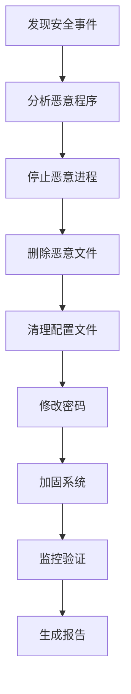

# 安全事件处理文档

## 📋 文档概述

本目录包含服务器安全事件的完整处理文档和工具。在服务器 `120.48.95.51` 上发现了加密货币挖矿恶意程序和反向代理程序，以下是完整的分析和处理方案。

## 🚨 事件摘要

**发现时间**: 2025年12月31日  
**事件类型**: 恶意软件感染（XMRig挖矿程序 + 反向代理）  
**受影响服务器**: 120.48.95.51  
**受影响用户**: postgres (UID: 1001)  
**严重等级**: 🔴 高危

### 恶意程序特征
- **挖矿程序**: `/var/tmp/.sys/.bioset` (7MB XMRig)
- **反向代理**: `/var/tmp/.sys/.netd`
- **配置文件**: `/var/tmp/.sys/.netd.toml`
- **持久化**: 通过 `/home/postgres/.profile` 自动启动

### 已发现的恶意连接
- 挖矿服务器: 141.95.110.188:7000
- C2服务器: 5.255.115.190:48996 (荷兰)
- 攻击者IP: 46.101.179.170 (暴力破解)

## 📁 文档列表

### 1. SECURITY_INCIDENT_REPORT.md
**详细的安全事件报告**

包含内容：
- 事件概述和恶意程序详情
- 网络连接分析
- 入侵路径分析
- 影响评估
- 立即执行的清理步骤
- 长期安全加固措施
- 恢复验证清单
- 后续监控建议
- IOC（入侵指标）

**适用场景**: 
- 深入了解安全事件
- 向管理层汇报
- 制定安全策略
- 安全审计

### 2. security_cleanup.sh
**自动化安全清理脚本**

功能特点：
- ✅ 自动停止恶意进程
- ✅ 自动删除恶意文件
- ✅ 清理用户配置文件
- ✅ 处理SSH密钥
- ✅ 提示修改密码
- ✅ 修复数据库配置
- ✅ 配置防火墙
- ✅ 安装fail2ban
- ✅ 生成详细报告

**使用方法**:
```bash
# 1. 将脚本上传到服务器
scp security_cleanup.sh root@120.48.95.51:/tmp/

# 2. SSH登录到服务器
ssh root@120.48.95.51

# 3. 赋予执行权限
chmod +x /tmp/security_cleanup.sh

# 4. 以root权限执行
sudo bash /tmp/security_cleanup.sh
```

**注意事项**:
- 必须以root权限运行
- 脚本会自动创建备份
- 会提示确认敏感操作
- 执行时间约5-10分钟

### 3. QUICK_REFERENCE.md
**快速参考指南**

包含内容：
- 🚨 紧急命令（立即执行）
- 🔍 检查命令
- 🛡️ 安全加固
- 📋 检查清单
- 🔧 工具命令
- 📞 应急联系
- 📝 重要提醒
- 🔄 定期维护

**适用场景**:
- 快速查找命令
- 日常运维参考
- 应急响应
- 培训新员工

## 🚀 快速开始

### 方案一：使用自动化脚本（推荐）

```bash
# 1. 上传并执行清理脚本
scp security_cleanup.sh root@120.48.95.51:/tmp/
ssh root@120.48.95.51 "chmod +x /tmp/security_cleanup.sh && sudo bash /tmp/security_cleanup.sh"
```

### 方案二：手动执行（完全控制）

```bash
# 1. SSH登录
ssh root@120.48.95.51

# 2. 停止恶意进程
pkill -f '.netd' && pkill -f 'bioset' && pkill -f '/tmp/init'

# 3. 删除恶意文件
rm -rf /var/tmp/.sys/ && rm -f /tmp/init

# 4. 清理配置
cp /home/postgres/.profile.bak /home/postgres/.profile

# 5. 修改密码
passwd postgres && passwd root

# 6. 配置防火墙
ufw enable && ufw allow ssh && ufw allow 5432

# 7. 安装fail2ban
apt-get install -y fail2ban && systemctl enable fail2ban
```

## 📊 处理流程



## ✅ 验证清单

### 立即验证（执行清理后）
- [ ] 恶意进程已完全停止
  ```bash
  ps aux | grep -E 'bioset|netd|minerd|xmrig' | grep -v grep
  ```
- [ ] 恶意文件已完全删除
  ```bash
  ls -la /var/tmp/.sys/ 2>/dev/null || echo "已删除"
  ```
- [ ] .profile已清理干净
  ```bash
  cat /home/postgres/.profile | grep -E 'bioset|netd' || echo "已清理"
  ```
- [ ] 用户密码已修改
  ```bash
  # 手动验证密码已更改
  ```

### 系统加固验证
- [ ] 防火墙已启用
  ```bash
  ufw status
  ```
- [ ] fail2ban已运行
  ```bash
  systemctl status fail2ban
  ```
- [ ] PostgreSQL配置已修复
  ```bash
  cat /etc/postgresql/16/main/pg_hba.conf | grep trust || echo "已修复"
  ```
- [ ] SSH配置已加固
  ```bash
  grep "PermitRootLogin no" /etc/ssh/sshd_config
  ```

## 🔍 持续监控

### 每日检查
```bash
# 创建监控脚本
cat > /root/daily_check.sh << 'EOF'
#!/bin/bash
echo "=== 每日安全检查 - $(date) ==="
echo ""
echo "1. 检查恶意进程:"
ps aux | grep -E 'bioset|netd|minerd|xmrig' | grep -v grep || echo "  ✓ 未发现"
echo ""
echo "2. 检查网络连接:"
netstat -tunp | grep ESTABLISHED | grep -v "127.0.0.1" | head -10
echo ""
echo "3. 检查登录失败:"
tail -10 /var/log/auth.log | grep "Failed password" || echo "  ✓ 无失败记录"
echo ""
echo "4. 检查系统负载:"
uptime
echo ""
echo "5. 检查磁盘使用:"
df -h | grep -vE '^Filesystem|tmpfs|cdrom'
EOF

chmod +x /root/daily_check.sh

# 添加到crontab
(crontab -l 2>/dev/null; echo "0 8 * * * /root/daily_check.sh >> /var/log/daily_check.log 2>&1") | crontab -
```

### 每周检查
```bash
# 创建周检查脚本
cat > /root/weekly_check.sh << 'EOF'
#!/bin/bash
echo "=== 每周安全检查 - $(date) ==="
echo ""
echo "1. 系统更新:"
apt-get update -qq && apt-get upgrade -y
echo ""
echo "2. 安全扫描:"
rkhunter --check --skip-keypress
echo ""
echo "3. 用户审计:"
last -n 20
echo ""
echo "4. 磁盘清理:"
apt-get autoremove -y
apt-get clean
EOF

chmod +x /root/weekly_check.sh

# 添加到crontab
(crontab -l 2>/dev/null; echo "0 2 * * 0 /root/weekly_check.sh >> /var/log/weekly_check.log 2>&1") | crontab -
```

## 📞 获取帮助

### 文档使用问题
- 查看 `QUICK_REFERENCE.md` 获取快速命令参考
- 查看 `SECURITY_INCIDENT_REPORT.md` 了解详细信息

### 技术支持
- 系统管理员: [填写联系方式]
- 安全团队: [填写联系方式]
- 数据库管理员: [填写联系方式]

### 在线资源
- Ubuntu安全: https://ubuntu.com/security
- PostgreSQL安全: https://www.postgresql.org/support/security/
- XMRig信息: https://xmrig.com/docs

## 📝 更新日志

### v1.0 (2025-12-31)
- 初始版本
- 完成安全事件分析
- 创建清理脚本
- 编写参考文档

## ⚠️ 重要提醒

1. **立即行动**: 发现安全事件后应立即处理，不要拖延
2. **备份优先**: 执行任何清理操作前先备份重要数据
3. **全面检查**: 不要只处理表面问题，要深入检查系统
4. **持续监控**: 清理完成后要持续监控系统状态
5. **文档记录**: 详细记录所有操作和发现，便于后续审计

## 🔐 安全建议

### 短期（1周内）
1. 修改所有用户密码为强密码
2. 重新生成SSH密钥对
3. 配置防火墙和fail2ban
4. 修复PostgreSQL配置
5. 审查所有用户账户

### 中期（1个月内）
1. 建立安全基线
2. 制定应急响应计划
3. 进行安全培训
4. 实施访问控制
5. 建立监控体系

### 长期（持续）
1. 定期安全审计
2. 更新系统补丁
3. 监控安全公告
4. 改进安全策略
5. 提升安全意识

---

**文档维护**: 请定期更新此文档，确保信息的准确性和时效性。

**最后更新**: 2025年12月31日  
**版本**: 1.0  
**维护者**: 系统安全团队
